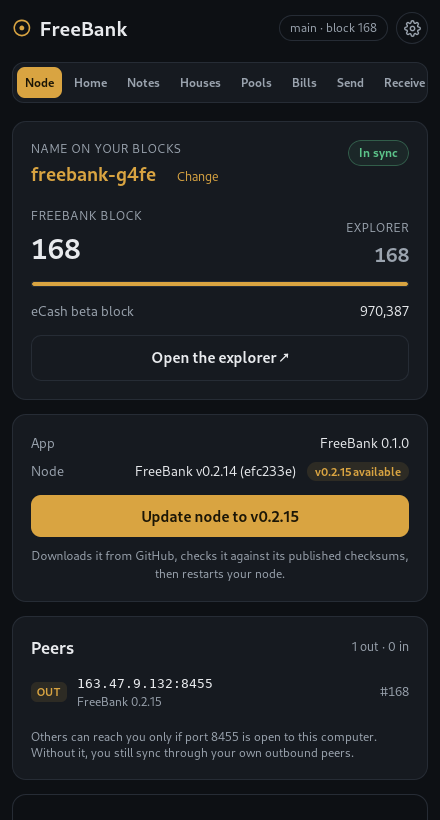

# FreeBank

The desktop app for the [**FreeBank**](https://github.com/mbdrivechains/freebank) credit-creation
drivechain (BIP 300/301, slot 130): it sets up and runs a FreeBank node beside your eCash beta node,
shows its blocks and peers, and is its wallet.

## Install

**Ubuntu 22.04+ / Debian 12+** from the apt repository (updates arrive with your system updates):

```bash
sudo wget -qO /usr/share/keyrings/freebank-archive-keyring.gpg https://apt.ecxfreebank.com/freebank-archive-keyring.gpg \
&& echo "deb [signed-by=/usr/share/keyrings/freebank-archive-keyring.gpg] https://apt.ecxfreebank.com stable main" \
  | sudo tee /etc/apt/sources.list.d/freebank.list \
&& sudo apt update && sudo apt install freebank
```

**Other Linux:** the AppImage, and **macOS (Apple Silicon):** the `.dmg`, both on the
[releases page](https://github.com/mbdrivechains/freebank-app/releases). The macOS build is not signed yet,
so the first time macOS will refuse to open it: go to **System Settings → Privacy & Security** and
choose **Open Anyway**. Every release lists `SHA256SUMS`.



Built with [Tauri](https://tauri.app) (Rust backend + Svelte frontend). The same web
frontend doubles as an installable **PWA**, so the wallet runs as a desktop app, a
direct-download binary, or a web page.

## Model: node-custodial, remote-controlled

FreeBank is **node-custodial** — your keys live on your `freebankd` node, not in this app.
The wallet is a thin remote control over JSON-RPC. That means you can:

- connect to the node on **this computer**, or
- reach **your own node from anywhere** over **Tailscale** (enter its `100.x.y.z` address),
  e.g. from a laptop while travelling — **your keys never leave the node**.

(A client-side-keys light wallet — "Model B" — is a later roadmap item. Tor transport is a
first-class option in the UI but not wired in this build yet.)

## First run (desktop)

On a computer that already runs an **eCash beta full node and its enforcer** (the easiest way
is [BitWindow](https://releases.drivechain.info) in full-node mode on eCash beta), FreeBank
finds them, downloads and verifies the newest FreeBank node, asks for the name your blocks
carry on the [explorer](https://explorer.ecxfreebank.com), and starts the node. The **Node**
tab then shows its height against the explorer and its peers. If the node is already running,
the app just connects to it.

## Features

- Connect to a `freebankd` node via RPC (local / Tailscale / custom)
- Balance led in **grams** (☉, launch scale, presentation-only) with the **ECX**
  settlement line; transaction history
- Send and receive ECX; address generation
- **Notes** — hold / mint / send / redeem / demand, per issuing house
- **Houses** — directory, registration, reserve attestation
- **Clearing pools** — swap notes ↔ ECX, add/remove liquidity, LP positions
- **Bills of exchange** — issue / endorse / retire / claim escrow
- (Planned) bearer par-redemption flow, advisory gold oracle, "Model B" light wallet

## Quick Start

### Prerequisites

```bash
# Rust
curl --proto '=https' --tlsv1.2 -sSf https://sh.rustup.rs | sh
# Node.js 20+
curl -fsSL https://deb.nodesource.com/setup_20.x | sudo -E bash -
sudo apt install -y nodejs
# Tauri CLI + Linux webview deps
cargo install tauri-cli
sudo apt install libwebkit2gtk-4.1-dev libappindicator3-dev librsvg2-dev patchelf
```

### Development

```bash
git clone https://github.com/mbdrivechains/freebank-app.git
cd freebank-app
npm install
cargo tauri dev        # desktop, hot reload
# or, browser/PWA:
npm run dev            # then open http://localhost:5173
```

### Build Release

```bash
npx tauri build        # -> src-tauri/target/release/bundle/  (always via the tauri CLI: it bundles the front end)
```

Releases are built by `.github/workflows/release.yml` on a `vX.Y.Z` tag: Linux (`.deb`, AppImage) on
Ubuntu 22.04, macOS on Apple Silicon, a GitHub Release with checksums, and the signed apt repository on
the `gh-pages` branch (served at https://apt.ecxfreebank.com).

## Connect to a node

The wallet needs a running `freebankd` node with RPC enabled:

```bash
# main (RPC 8454); the app reads the node's cookie file, so no password is needed locally
freebankd -daemon

# to reach it remotely, bind RPC to the Tailscale interface and allow the client:
#   -rpcbind=<tailscale-ip> -rpcallowip=<client-tailscale-ip-or-cidr>
```

FreeBank has two networks only — **main** (RPC 8454) and **regtest** (RPC 18457); there is
no testnet. Then enter the host/port/credentials in the connect screen.

### Browser (PWA) mode + CORS

A browser page can't send RPC directly (CORS). For local development, run the bundled CORS proxy
on this computer; it listens on 127.0.0.1 only, answers only the dev origin, and passes on the
login the page sends rather than adding one:

```bash
python3 proxy.py --rpc-port 8454
```

## Architecture

```
┌─────────────────────────────────────────┐
│         Svelte Frontend (+ PWA)         │
│ Connect · Notes · Houses · Pools · Bills│
└─────────────────┬───────────────────────┘
     Tauri IPC    │    or  direct fetch (PWA + CORS proxy)
┌─────────────────▼───────────────────────┐
│        Rust Backend (FreeBankClient)    │
│         JSON-RPC client (reqwest)       │
└─────────────────┬───────────────────────┘
                  │ JSON-RPC (local / Tailscale / Tor)
┌─────────────────▼───────────────────────┐
│      freebankd  (drivechain slot 130)   │
│  keys · notes · houses · pools · bills  │
└─────────────────────────────────────────┘
```

## License

MIT, see [LICENSE](LICENSE).
